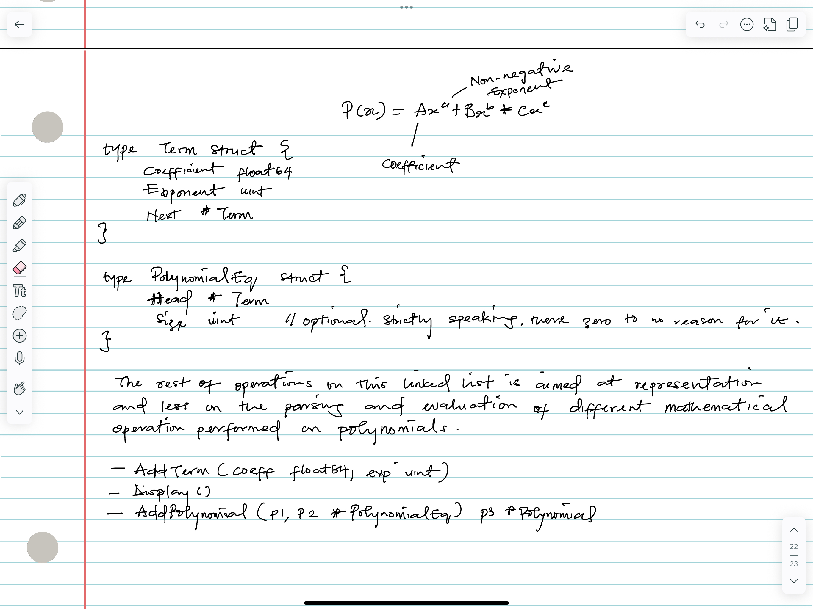

# Polynomial Representation

A polynomial is an algebraic expression consisting of indeterminates and coefficients. Permissible operations involve addition, subtraction, multiplication, and non-negative integer exponents of indeterminates. For example, a polynomial in one indeterminate, `x`, looks like the below:

$$P(x) = 5x^4 − 7x^2 + 3x + 10$$

Each part like $5x^4$, $-7x^2$, $3x$ (which is $3x^1$), and $10$ (which is $10x^0$) is called a term. Each term has a coefficient and exponent.

## Why use linked lists for Polynomical?

Good question...actually not a good question. Meh, consider a polynomial like $$P(x) = 9x^{1000} + 2$$

Naively, if I was to represent it using an array...uhmm rookie, where the index would represent the exponent, then I'd need an array with a size of 1001 (you know, the openness of the indexing, [0, 1001), accounting for the 1000th index). The rest of the slots in this array would be zero-value initialized, which is significant waste of memory. Yeah, forgive my rookie mistake.

> $P(x) = 9x^{1000} + 2$ is known as a sparse polynomial.

Conversely, Linked lists offers a cleaner and memory-efficient proposition for polynomials including our dearly friend, sparse polynomials. Also, we don't need to store the non-zero terms.

## Representing Polynomials with Linked lists

Honestly, just see the content of the source file, `./polynomial.go`, hopefully it's not that horrifying, implementation-wise. We can represent a polynomial as a linked list where each node in the list stores a single non-zero term. Simply, each node would contain:

1. The coefficient of the term.
2. The exponent of the term.
3. A pointer to the next term node.

I chose to store the terms in the linked list in a descreasing order of their exponents. The internet said it simplifies the maths operations.

